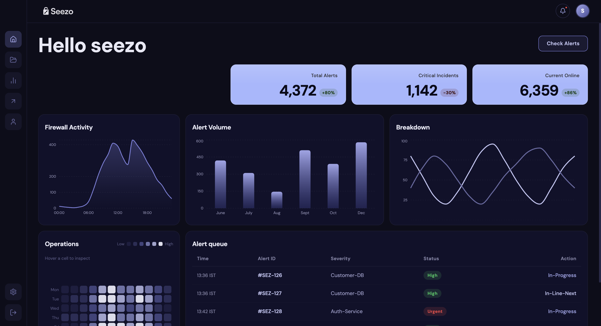
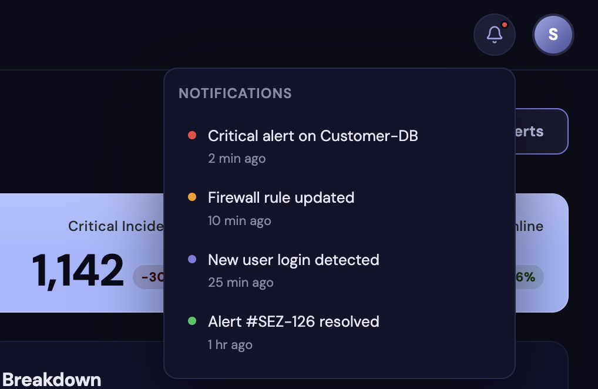
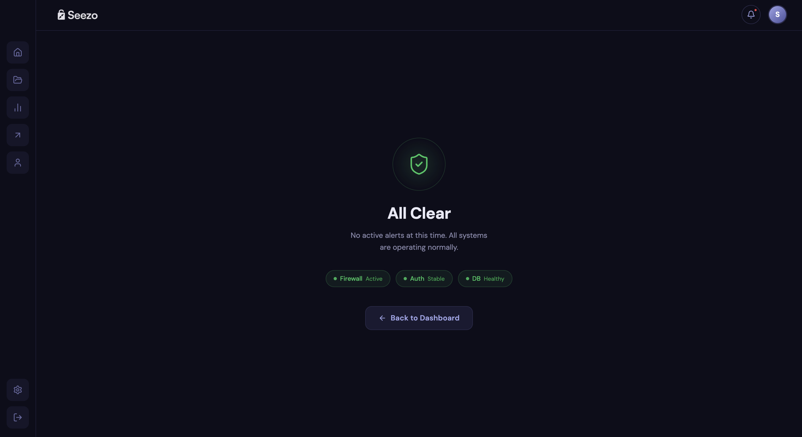

# Seezo Dashboard

A modern, dark-themed cybersecurity monitoring dashboard built with React, Tailwind CSS, and Recharts. Designed for real-time security operations visibility with a clean, professional UI.

---

## Screenshots

### Main Dashboard
<!-- Add screenshot here -->

### Notification Panel
<!-- Add screenshot here -->

### Check Alerts Page
<!-- Add screenshot here -->

---

## Tech Stack

- **React 18** — component-based UI
- **Vite 5** — fast dev server and build tool
- **Tailwind CSS v4** — utility-first styling
- **Recharts** — chart library for all data visualizations
- **React Router v6** — client-side routing with smooth page transitions
- **Lucide React** — icon set
- **shadcn/ui** — base component primitives

---

## Features

### Animations & Transitions
- Smooth `fadeSlideIn` animation on every page navigation
- Staggered `fadeSlideUp` on KPI cards loading in
- Hover lift effects on cards, buttons, and sidebar icons
- Sidebar icons scale up on hover with a subtle pop
- Notification dropdown animates open with a fade-slide

### Dashboard Sections
- **KPI Cards** — Total Alerts, Critical Incidents, Current Online with color-coded change badges
- **Firewall Activity** — area chart with gradient fill showing 24-hour traffic
- **Alert Volume** — bar chart with gradient bars that brighten on hover, showing monthly trends
- **Breakdown** — dual line chart with interactive hover showing both series values
- **Operations** — heatmap grid showing operational load by day and hour, cybersecurity-style
- **Alert Queue** — live table with color-coded severity badges and action statuses

### Navigation
- Sidebar with 5 main nav icons + settings and logout at the bottom
- Bell icon with red dot indicator opens a notification dropdown
- Avatar click navigates to profile page
- Check Alerts button navigates to a dedicated alerts status page
- All placeholder pages styled consistently with coming soon state

---

## Connecting a Real Database

Currently all data is hardcoded in `src/data/dashboardData.js` as static arrays. To connect a live database:

